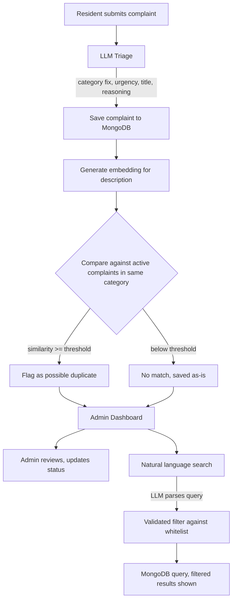

# SocietySense

Built this for the AI Engineer take-home at Zaptoz. Housing society complaint tracker, 36 hours, and I got to pick my own AI feature instead of being told what to build.

Live: https://societysense-v2.onrender.com/pages/login

Heads up, it's on Render's free tier so if nobody's hit it in a bit the first load takes 20-30 seconds. Just wait it out.

Login:
Resident: ssdhankar2002@gmail.com / password123
Admin: user@example.com / password123

## What it does

Residents file a complaint, pick a category, write what's wrong. Admins see the list and move things between Open, In Progress, Resolved. That part is nothing special, every take-home like this needs it.

Where it gets more interesting is what happens the moment a complaint hits the database.

An LLM looks at the text first. If someone picked the wrong category it gets corrected. It also decides how urgent the thing is and writes a short title, plus a one line note on why it picked that urgency. Somebody writes "gas smell near parking, getting stronger" and files it under Other, this step moves it to high urgency and logs the reason. That part felt important to get right because urgency decisions are the kind of thing an admin actually reads.

Then there's duplicate detection, which honestly is the feature I care about most here. New complaint comes in, gets embedded, and I check it against other open or in-progress complaints in the same category using cosine similarity. Cross a threshold, currently 0.85 but that's a config value not a hardcoded number, and it gets flagged as a possible duplicate for the admin to look at. It never merges anything on its own. Two complaints can read almost word for word the same and still be different buildings, so I wasn't going to let the model make that call by itself.

Last piece is a search bar for admins. Type "show open electrical complaints" instead of clicking through dropdowns, and an LLM turns that into an actual filter. I don't just trust whatever comes back from the model though, it gets checked against a fixed list of real categories and statuses before it ever touches a query. Learned that lesson the hard way after testing it with a deliberately weird input and seeing what came back.

## Pipeline



## Why these three

Duplicate detection came first, before I even thought about the other two. Kept thinking about how a real society admin deals with the same water leak getting reported by four different people in four different ways and nobody notices it's the same problem. The other two got added because I didn't want the whole AI story to rest on one technique. Triage is generative, search is structured extraction with guardrails bolted on, duplicate detection is retrieval. Three different things, not the same trick done thrice.

## Stack

FastAPI backend. Frontend is Jinja2 templates with HTMX, not a separate React app, mostly because I did not have time to manage two deployments on a 36 hour clock. MongoDB Atlas through Beanie. Groq handles the LLM calls, Gemini does embeddings. Deployed on Render.

Went with Mongo instead of Postgres because complaint documents end up carrying a bunch of AI fields that don't apply the same way to every record, embedding vector, urgency, a duplicate reference that's null most of the time. Felt more like a document than a row with ten nullable columns.

Cosine similarity runs in plain Python right now instead of through a real vector search setup. At this scale, a handful of complaints, that's totally fine and way less risky to get working than configuring Atlas Vector Search under deadline pressure. If this needed to actually scale I'd switch it, not a huge rewrite either.

## Duplicate detection, scoped down

Only checks within the same category and only against complaints still open or in progress. A resolved complaint from months back scoring high on text similarity doesn't tell you much, it's probably the same issue happening again, not the same unresolved ticket sitting there. Cut down false matches a lot once I actually started testing with realistic complaint text instead of toy examples.

## Schema

users: name, email, password_hash, role, created_at

complaints: resident_id, category, description, status, embedding, ai_title, ai_urgency, ai_reasoning, duplicate_of, similarity_score, created_at, updated_at

## Running it locally

```
git clone https://github.com/SurajSingh435/societysense.git
cd societysense
python -m venv venv
venv\Scripts\activate
pip install -r requirements.txt
```

Drop a `.env` in the root, check `.env.example` for what it needs, mainly your own MongoDB URI, a Groq key, and a Gemini key.

```
uvicorn app.main:app --reload
```

Then hit `localhost:8000/pages/login`.

## Env vars

MONGODB_URL, MONGODB_DB_NAME, SECRET_KEY, ALGORITHM, ACCESS_TOKEN_EXPIRE_MINUTES, GROQ_API_KEY, GROQ_BASE_URL, LLM_MODEL, EMBEDDING_API_KEY, EMBEDDING_MODEL, DUPLICATE_SIMILARITY_THRESHOLD

## Improvements
Loading state during AI processing — Complaint submit/search ke time spinner ya loading message show karna, because LLM/embedding API response mein thoda time lag sakta hai.
Reset form after successful submission — Complaint successfully submit hone ke baad category/description fields automatically clear karna.
Improve overall UI/UX — Dashboard, complaint cards, spacing, responsiveness, loading/error/success feedback ko more polished banana.
Resident self-registration — Residents ko khud account create karne ka option dena.
Restricted admin account creation — Public admin registration na dena; admin accounts controlled/authorized process se hi create hon.
Better date/time formatting — Raw timestamps ki jagah readable date/time display karna.
Newest complaints first — Complaints ko created_at descending order mein sort karna so latest complaint top par aaye.
Scientifically tune the 0.85 duplicate threshold — Labeled duplicate/non-duplicate complaint pairs bana kar different thresholds ko precision, recall aur F1-score se evaluate karna instead of relying mainly on manual testing.


## One more thing

Render's default Python build is 3.14 right now, and its SSL handshake does not get along with MongoDB's driver at all. First deploy just failed with a cryptic SSL error and it took a while to figure out it was a Python version problem, not a code problem. Fixed it by pinning PYTHON_VERSION=3.13.4 as an environment variable. On top of that a Groq model and a Gemini embedding model both got deprecated partway through building this, which is annoying but also why none of the model names are hardcoded anywhere in the code. Swapping one out now is an env var change, not a redeploy-and-debug situation.
